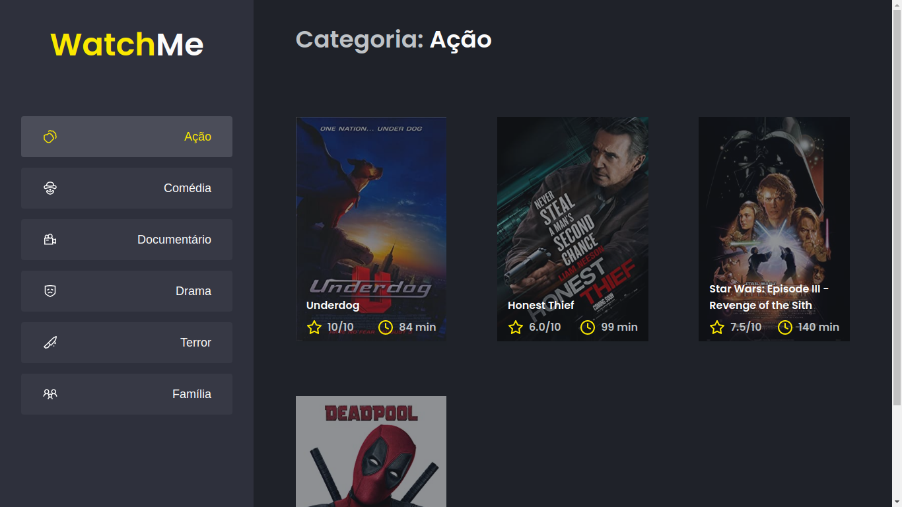

# WatchMe



> Performando uma aplicação React utilizando das ferramentas e dicas aprendidas durante o módulo Performando apps com ReactJS do Ignite.

## 💻 Pré-requisitos

Antes de começar, verifique se você atendeu aos seguintes requisitos:

- Você tem uma máquina `<Windows / Linux / Mac >`.

## 🚀 Instalando o projeto na sua maquina

Para instalar o projeto, siga estas etapas:

Linux e macOS:

```bash
git clone https://github.com/alextfonseca/ignite-template-otimizando-a-aplicacao.git
$ cd ignite-template-otimizando-a-aplicacao
$ yarn / npm i
$ yarn dev / npm run dev & yarn server / npm run server
```

Windows:

```bash
git clone https://github.com/alextfonseca/ignite-template-otimizando-a-aplicacao.git
$ cd ignite-template-otimizando-a-aplicacao
$ yarn / npm i
$ yarn dev / npm run dev & yarn server / npm run server
```

## 🧑‍💻 Criador

<table>
  <tr>
    <td align="center">
      <a href="https://github.com/alextfonseca">
        <br>
        <sub>
          <b>Alex Teixeira da Fonseca</b>
        </sub>
      </a>
    </td>
  </tr>
</table>

## 😄 Me siga nas redes sociais<br>

<p align="left">

  <a href="https://www.linkedin.com/in/alex-teixeira-da-fonseca-5a99931a2/" alt="Linkedin">
  </a>

  <a href="https://wa.me/+5511976184659?text=Olá%20Alex" alt="WhatsApp">
  </a>

  <a href="https://www.instagram.com/devalextf/?hl=pt-br" alt="Instagram">
  </a>
</p>
